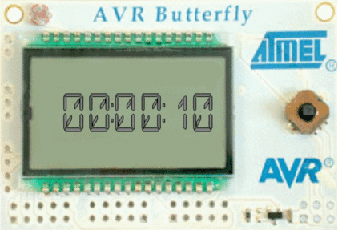

# Bomb timer



## Usage

Upon starting up, the initial value of **00:00:00** is displayed on the LCD.
Seconds are configured using the joystick's up or down buttons.
Moving the joystick left or right will switch to configuring minutes or seconds respectively.  
Pressing the middle button triggers the countdown. When it reaches 0, a brief message
is displayed, after which the state is restored back to previously set value, waiting for further
user input.   
The timer uses only minutes and seconds, but it can be trivially extended to work with hours.

## Requirements

- AVRStudio 4.x
- AVR Butterfly board

## Importing

- File->Open File-> Select ```bomb.aps```

